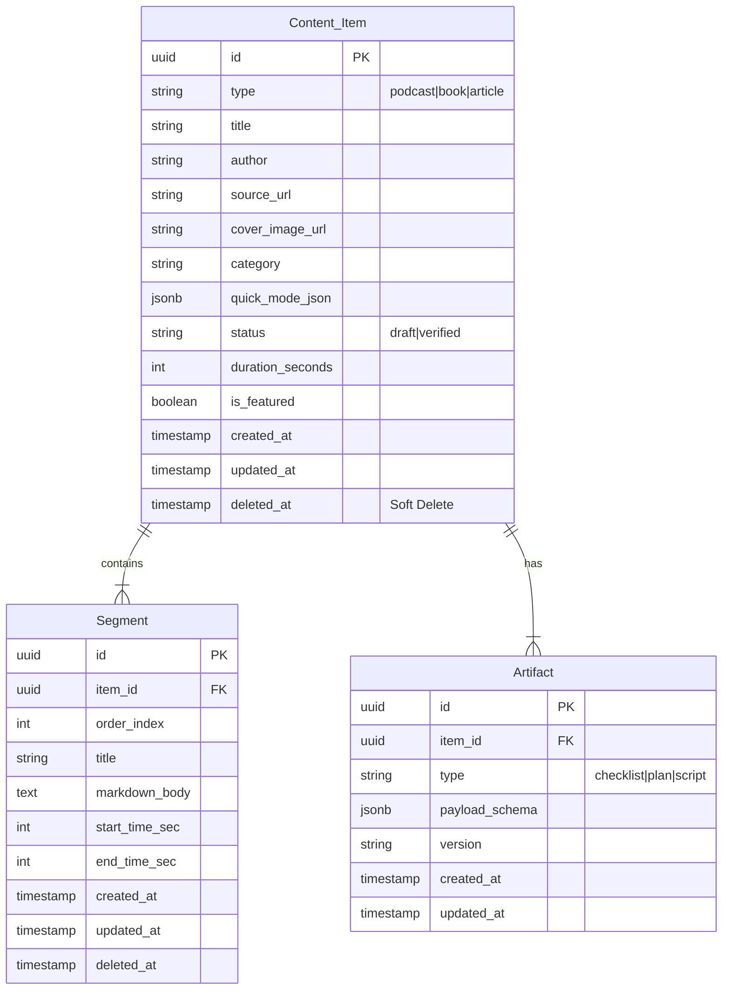

# ARCHITECTURE.md: Flux

> **Status:** Active  
> **Last Updated:** February 2026  
> **North Star:** "Curated knowledge, publicly accessible, beautifully presented."

## 1. Product Overview

Flux is a **founder-curated content platform**. The founder uploads summaries of podcasts, books, and articles. Visitors browse and read content freely without creating accounts.

### Key Principles

1. **Public-First**: All content is publicly accessible. No login required to browse or read.
2. **Local State (Optional)**: Reading progress and checklist completion stored in browser localStorage.
3. **Admin-Only Upload**: Only the founder can add/edit content via a protected admin panel.
4. **Interactive Artifacts**: Checklists and other interactive utilities attached to content.

---

## 2. High-Level System Design

### Zone A: Public Content (The Stream)

* **Strategy:** Incremental Static Regeneration (ISR) for SEO.
* **Goal:** Sub-100ms TTFB, excellent SEO for discoverability.
* **Routes:** `/` (Home), `/read/[id]`, `/search`, `/random`.
* **Data Source:** Supabase with public read access.

### Zone B: Admin Panel (Content Management)

* **Strategy:** Server-side protected route.
* **Goal:** Simple interface for founder to upload/edit content.
* **Routes:** `/admin`, `/admin/content/new`, `/admin/content/[id]/edit`.
* **Protection:** Supabase Auth session + RBAC (`profiles.role = 'admin'`).

---

## 3. Technology Stack

| Layer | Technology | Purpose |
| --- | --- | --- |
| **Framework** | Next.js (App Router) | Server Components + ISR |
| **Language** | TypeScript (strict) | Type safety |
| **Styling** | Tailwind CSS | Utility-first CSS |
| **Database** | Supabase (PostgreSQL, Hosted) | Content storage (cloud) |
| **Storage** | Supabase Storage (Hosted) | Image/media uploads |
| **Auth** | Supabase Auth (Hosted) | User authentication & admin access |
| **Local Storage** | localStorage | Reading progress, checklist state |
| **Drag & Drop** | dnd-kit | Segment reordering in admin |
| **Validation** | Zod | Runtime type validation |

---

## 4. Data Architecture

### 4.1 Entity Relationship Diagram



### 4.2 Quick Mode JSON Schema

Stored in `content_item.quick_mode_json`:

```json
{
  "hook": "One sentence that captures attention.",
  "big_idea": "The core thesis or main takeaway.",
  "key_takeaways": [
    "Bullet point 1",
    "Bullet point 2",
    "Bullet point 3"
  ]
}
```

### 4.3 Artifact Payload Schemas

**Checklist** (`artifact.type = 'checklist'`):

```json
{
  "title": "Morning Routine Checklist",
  "items": [
    { "id": "item-1", "label": "Wake up at 5 AM", "mandatory": true },
    { "id": "item-2", "label": "Drink water", "mandatory": false }
  ]
}
```

### 4.4 Data Rules

1. **Soft Deletes**: All queries filter `WHERE deleted_at IS NULL`.
2. **Verified Only**: Public queries filter `WHERE status = 'verified'`.
3. **Timestamps**: Every table has `created_at` and `updated_at`.
4. **Featured Content**: `is_featured = true` items appear in hero carousel.

---

## 5. Client-Side State

Since there are no mandatory user accounts, personalization is stored locally in the browser.

### 5.1 Checklist Progress (localStorage)

```typescript
// Key: "flux-checklist-{artifactId}"
// Value: Record<itemId, boolean>

interface ChecklistProgress {
  [itemId: string]: boolean;
}
```

### 5.2 Reading Progress (localStorage)

```typescript
// Key: "flux-progress"
// Value: Record<itemId, ProgressState>

interface ProgressState {
  lastSegmentId: string;
  lastReadAt: string; // ISO timestamp
  completed: boolean;
}
```

---

## 6. Security

### 6.1 Database Access

| Table | Public Access | Admin Access |
| --- | --- | --- |
| `content_item` | SELECT (verified only) | ALL |
| `segment` | SELECT (via verified item) | ALL |
| `artifact` | SELECT (via verified item) | ALL |

### 6.2 Admin Protection

The admin panel is protected by Supabase Auth session validation and server-side admin role checks.

### 6.3 Input Validation

* All admin form inputs validated with Zod schemas.
* Markdown content sanitized before rendering.

---

## 7. Performance

### 7.1 Caching Strategy

| Route | Strategy | Revalidation |
| --- | --- | --- |
| `/` (Home) | ISR | 1 hour |
| `/read/[id]` | ISR | 1 hour |
| `/search` | Dynamic | N/A |
| `/admin/*` | No cache | N/A |

### 7.2 Bundle Budget

* Homepage: < 150kb gzipped
* Reader: < 200kb gzipped

---

## 8. Content Categories

Categories for organizing content lanes on homepage:

- **Health** — Nutrition, mental health, wellness
- **Fitness** — Exercise, sports, physical training
- **Wealth** — Investing, saving, financial independence
- **Finance** — Money management, budgeting
- **Productivity** — Time management, habits, focus
- **Mindset** — Psychology, cognitive biases, motivation
- **Relationships** — Communication, dating, family
- **Science** — Research, discoveries, learning
- **Business** — Startups, leadership, entrepreneurship
- **Philosophy** — Meaning, ethics, life lessons
- **Technology** — AI, software, innovation
- **Lifestyle** — Routines, life optimization

---

## 9. Future Considerations

These features are **not in MVP** but may be added later:

1. **PDF Export** — Download content as PDF
2. **Offline Cache** — IndexedDB for offline reading
3. **Full-text Search** — Meilisearch integration
4. **Newsletter** — Email notifications for new content
5. **Analytics** — View counts and reading time metrics
