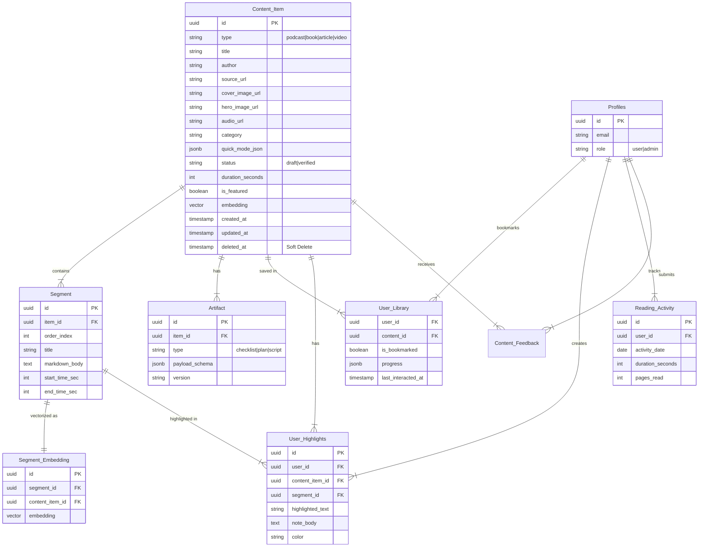

# ARCHITECTURE.md: Flux

> **Status:** Active  
> **Last Updated:** February 2026  
> **North Star:** "Curated knowledge, publicly accessible, beautifully presented."

## 1. Product Overview

Flux is a **curated content platform** with public browsing and personalized user experiences. The founder uploads summaries of podcasts, books, articles, and videos. Visitors browse and read freely, while authenticated users can track their reading progress, save highlights, take notes, and interact with an AI answering engine about the content.

### Key Principles

1. **Public-First Discovery**: All content is publicly accessible. No login required to browse or read.
2. **Personalized State (Authenticated)**: Reading progress, highlights, notes, and library bookmarks are securely synced across devices for signed-in users.
3. **Local State (Unauthenticated)**: Guest users utilize browser localStorage for checklist progress tracking.
4. **Admin-Only Content Creation**: Only the founder can add/edit content or sync AI embeddings via a protected admin panel.
5. **AI Enhanced**: Provides semantic search and a generative AI Chat interface based on vectorized content summaries.

---

## 2. High-Level System Design

### Zone A: Public Content (The Stream)

* **Strategy:** Incremental Static Regeneration (ISR) for SEO and performance.
* **Goal:** Sub-100ms TTFB, excellent SEO for discoverability.
* **Routes:** `/` (Home), `/read/[id]`, `/search`, `/random`.
* **Data Source:** Supabase with public read access.

### Zone B: Admin Panel (Content Management & AI Ops)

* **Strategy:** Server-side protected route.
* **Goal:** Powerful interface for founder to upload/edit content and sync AI embeddings.
* **Routes:** `/admin`, `/admin/content/new`, `/admin/content/[id]/edit`.
* **Protection:** Supabase Auth session + RBAC (`profiles.role = 'admin'`).

### Zone C: Authenticated User Features

* **Strategy:** Client-side data fetching with Server Actions.
* **Goal:** Cross-device synchronization of library, highlights, notes, and reading activity heatmap.
* **Routes:** `/login`, `/profile`, `/library`, `/notes`, `/ask`, `/settings`.
* **Protection:** Supabase Auth session via cookies.

---

## 3. Technology Stack

| Layer | Technology | Purpose |
| --- | --- | --- |
| **Framework** | Next.js (App Router) | Server Components + ISR + Server Actions |
| **Language** | TypeScript (strict) | Type safety |
| **Styling** | Tailwind CSS | Utility-first CSS |
| **Database** | Supabase (PostgreSQL, pgvector) | Content storage & Vector Similarity |
| **Storage** | Supabase Storage (Hosted) | Image/media uploads |
| **Auth** | Supabase Auth (Hosted) | Email/Google OAuth authentication |
| **AI LLMs** | Langchain/OpenAI | Content Generation & Chat Inference |
| **Local Storage** | localStorage | Guest checklist state, temporary cache |
| **Drag & Drop** | dnd-kit | Segment reordering in admin |
| **Validation** | Zod | Runtime type validation |

---

## 4. Data Architecture

### 4.1 Entity Relationship Diagram



### 4.2 Quick Mode JSON Schema

Stored in `content_item.quick_mode_json`:

```json
{
  "hook": "One sentence that captures attention.",
  "big_idea": "The core thesis or main takeaway.",
  "key_takeaways": [
    "Bullet point 1",
    "Bullet point 2",
    "Bullet point 3"
  ]
}
```

### 4.3 Artifact Payload Schemas

**Checklist** (`artifact.type = 'checklist'`):

```json
{
  "title": "Morning Routine Checklist",
  "items": [
    { "id": "item-1", "label": "Wake up at 5 AM", "mandatory": true },
    { "id": "item-2", "label": "Drink water", "mandatory": false }
  ]
}
```

### 4.4 Data Rules

1. **Soft Deletes**: Primary queries filter `WHERE deleted_at IS NULL`.
2. **Verified Only**: Public queries filter `WHERE status = 'verified'`.
3. **Timestamps**: Most tables have `created_at` and `updated_at`.
4. **Featured Content**: `is_featured = true` items appear in hero carousel.
5. **AI Vector Storage**: Uses pgvector integration within Supabase (`vector` data type on embeddings table + HNSW indices).
6. **Data Isolation**: Read operations on user tables (profiles, highlights, libraries) require identical user_id.

---

## 5. Client-Side State

Since many functions moved to remote syncing (Auth), local state caching acts mostly as temporary or guest functionality.

### 5.1 Checklist Progress (localStorage, guest)

```typescript
// Key: "flux-checklist-{artifactId}"
// Value: Record<itemId, boolean>

export interface ChecklistProgress {
  [itemId: string]: boolean;
}
```

### 5.2 Remote User Progress (Supabase `user_library`)

- Once authenticated, user interactions hit the `user_library` and `reading_activity` tables directly for persisting reading locations and history. Reading activity accumulates on the server over >60 second thresholds to map out a GitHub-style activity Heatmap.

---

## 6. Security

### 6.1 Database Access

| Table | Public Access | Authenticated | Admin Access |
| --- | --- | --- | --- |
| `content_item` | SELECT (verified) | SELECT (verified) | ALL |
| `segment` | SELECT (via item) | SELECT | ALL |
| `profiles`, `user_library`, etc. | NONE | User's own data only | ALL |
| `artifact` | SELECT | SELECT | ALL |

### 6.2 Admin Protection

The admin panel is protected by Supabase Auth session validation and server-side admin role checks.

### 6.3 Input Validation

* All admin form inputs validated with Zod schemas.
* Markdown content sanitized before rendering.

---

## 7. Performance

### 7.1 Caching Strategy

| Route | Strategy | Revalidation |
| --- | --- | --- |
| `/` (Home) | ISR | 1 hour |
| `/read/[id]` | ISR | 1 hour |
| `/search` | Dynamic | N/A |
| `/admin/*` | No cache | N/A |
| `/library`, `/notes`, `/ask` | Dynamic | N/A |

### 7.2 Bundle Budget

* Homepage: < 150kb gzipped
* Reader: < 200kb gzipped

---

## 8. Content Categories

Categories for organizing content lanes on homepage:

- **Health** — Nutrition, mental health, wellness
- **Fitness** — Exercise, sports, physical training
- **Wealth** — Investing, saving, financial independence
- **Finance** — Money management, budgeting
- **Productivity** — Time management, habits, focus
- **Mindset** — Psychology, cognitive biases, motivation
- **Relationships** — Communication, dating, family
- **Science** — Research, discoveries, learning
- **Business** — Startups, leadership, entrepreneurship
- **Philosophy** — Meaning, ethics, life lessons
- **Technology** — AI, software, innovation
- **Lifestyle** — Routines, life optimization

---

### 9. Future Considerations

These features are **not in MVP** but may be added later:

1. **PDF Export** — Download content as PDF
2. **Offline Cache** — Advanced IndexedDB for full offline caching (Service Workers)
3. **Comments** — Discussion section on content
4. **Newsletter** — Email notifications for new content
